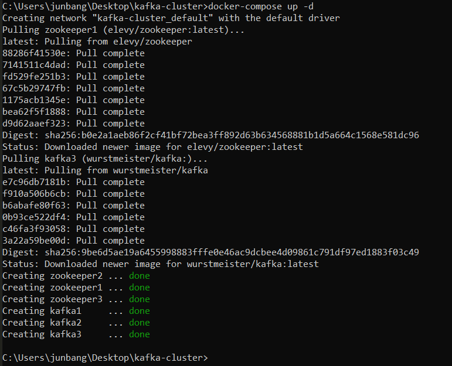

# Kafka Clusters with Zookeeper ensemble
Demonstrates Publish-Subscribe (Pub-Sub) Messaging. This is done by utilising 3 node Apache Kafka clusters along with Zookeeper ensemble which consists of 3 Zookeepers. This is accomplished using docker images of Kafka, Zookeeper and Kafkacat.

## Installation
1. [Docker](https://docs.docker.com/get-started/)

## How to set up and run the Kafka clusters
1. Download or Clone this repository.
1. Open Command prompt in the repository directory.
1. To start the docker machine, type `docker-machine start` OR click on **Docker Quickstart Terminal** .
1. To run the containers needed, type `docker-compose up -d` . This will pull the following images from `Docker Hub`. After which, it will run these containers and get the servers online.
    > Images pulled from `Docker Hub`:
    > 1. `wurstmeister/kafka`
    > 1. `elevy/zookeeper`

    *Expected Output*:
    
1. To check whether the containers are running, type `docker ps`

    *Expected Output*:
    

1. For ease of usage, we will use `Kafkacat` to navigate. To pull the docker image of `Kafkacat`, enter the following command:

    > `docker pull edenhill/kafkacat:1.6.0`

    *Expected Output*:
    

1. We will use `Kafkacat` to navigate the Kafka Clusters. To view the brokers and topics, type 

    `docker run -it --network=host edenhill/kafkacat:1.6.0 -b 192.168.99.100:9092,192.168.99.100:9093,192.168.99.100:9094 -L`. 
    
    The flag `-L` allows us to view the Metadata Listing of the Kafka cluster.

    *Expected Output*:
    

    Your Controller may be different from me as it is randomly selected. From the above output, you can see that Broker 1 who is connected to port `9092` is currently the Controller Broker and also the leader of `my-topic-1`.

    > If you don't see `0` topics, please try again as the servers are still starting up. There should be preset topics as shown above.

    > If you see `ERROR: Failed to acquire metadata: Local: Broker transport failure`, it could mean that your kafka clusters are not running correctly. You can redeploy by typing `docker-compose up -d`.
1. To view the content of the topic, we will use Kafka Consumer, which allows you to view the input provided by the Producer. To listen to the server as the consumer, type 

    `docker run -it edenhill/kafkacat:1.6.0 -b 192.168.99.100:9092,192.168.99.100:9093,192.168.99.100:9094 -C -t my-topic-1`. 

    This will allow the consumer to read the content of the `my-topic-1` topic. The `-C` flag represents Consumer. Usually, 1 broker is sufficient, however, we input 3 brokers (port: 9092, 9093, 9094) so that the Consumer can connect to another broker in case of broker outage.

    *Expected Output*: (**CONSUMER**)
    

    Since `my-topic-1` topic has no content yet, the offset is 0.
    
1. Open another Command Prompt. To add content to the topic, type

    `docker run -it edenhill/kafkacat:1.6.0 -b 192.168.99.100:9092,192.168.99.100:9093,192.168.99.100:9094 -P -t my-topic-1`

    This will allow the Producer to input data into the `my-topic-1` topic. The `-P` flag represents Producer.

    Now, you can send data to the server and it will be reflected at the Consumer side.

    *Expected Output*: (**PRODUCER**)
    

1. To show how the Pub-Sub Messaging works, we can send data to the server through the Producer and it will be reflected in the Consumer side. This is done by typing input into the Producer Command Prompt.

    *Expected Output*: (**PRODUCER**)
    

    *Expected Output*: (**Consumer**)
    

1. Done. The Publish-Subscribe Messaging System is up.

## How Kafka failover is handled with Zookeeper ensemble
> NOTE: This is a continuation from the instructions above. Please keep the Producer and Consumer Command Prompt on.

To demonstrate a Kafka failover, we will kill the process of the current Kafka Controller who is the leader of `my-topic-1`.

After the current controller is killed, the `Zookeeper ensemble` will elect another Kafka broker to serve as the Controller and leader of the respective topics. 

1. To view the current Controller, open another Command Prompt, and type

    `docker run -it --network=host edenhill/kafkacat:1.6.0 -b 192.168.99.100:9092,192.168.99.100:9093,192.168.99.100:9094 -L`

    *Expected Output*:
    

    Take note who is the `controller` and the topics which the controller is the leader.
    
     In my case, Broker 1 is the controller with port `9092` and Broker 1 is the leader of the `my-topic-1` topic. Note that leader 1 refers to broker 1.

1. To kill the container, we need the container id of the Controller broker with `port 9092`. Type

    `docker ps`

    *Expected Output*:
    

    Take note of the container ID. In my case, it is `b71d0f69edfb`.

1. To kill the container who holds the Kafka leader position, type

    `docker rm -f b71d0f69edfb`

    *Expected Output*:
    

1. To view the new leader, type

    `docker run -it --network=host edenhill/kafkacat:1.6.0 -b 192.168.99.100:9092,192.168.99.100:9093,192.168.99.100:9094 -L`

    *Old arrangement*:
    

    *New arrangement*:
    

    Another broker has taken over as the leader. In this case, Broker 2 is the new controller and new leader for `my-topic-1` topic. Meanwhile, the Consumer and Producer client should still up and working.

    > Please give it a moment as it takes a few seconds to elect a new controller and new leader for the respective topics.

1. You can still enter inputs via the Producer and they will be reflected in the Consumer client which shows that Kafka failover works.

    *Expected Output*: (**PRODUCER**)
    

    *Expected Output*: (**CONSUMER**)
    

    As shown above, in the last few lines of Producer and Consumer, messages can still be sent after the new controller and leader is elected.

    
## To terminate all the containers
1. Type `docker-compose down -v`.

## To terminate docker-machine
1. Type `docker-machine stop`.

## Docker images used
1. [wurstmeister/kafka](https://hub.docker.com/r/wurstmeister/kafka/)
1. [elevy/zookeeper](https://hub.docker.com/r/elevy/zookeeper)
1. [edenhill/kafkacat](https://hub.docker.com/r/edenhill/kafkacat)